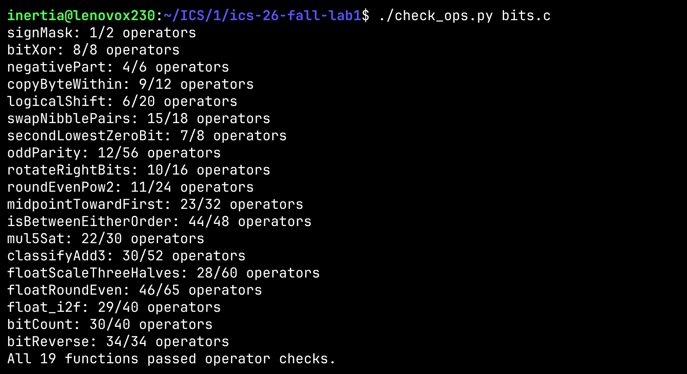
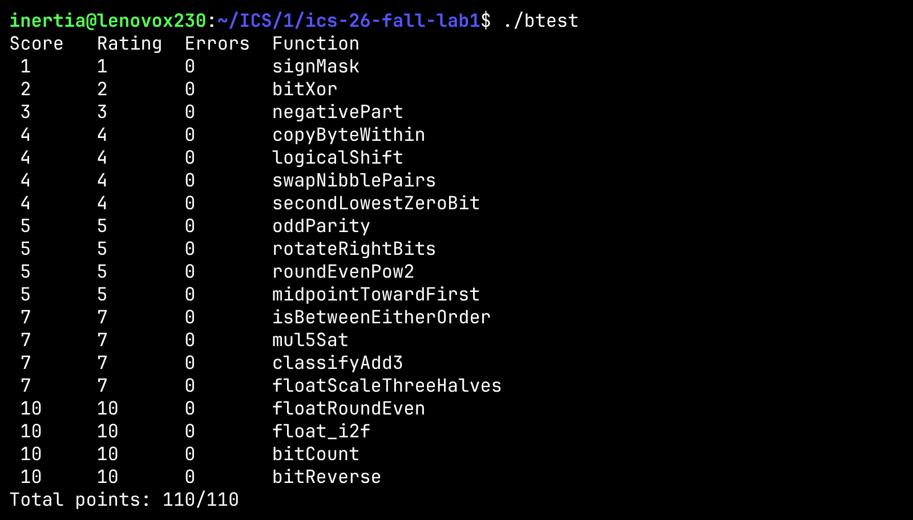

# Lab 1：Data Lab 实验报告

## 1. 运行截图

### 1.1 `./check_ops.py bits.c`

### 1.2 `./btest`

## 2. 各函数实现思路

### P1 `signMask`
直接 `1<<31` 得到只有最高位为 1 的掩码。

### P2 `bitXor`
只能用 `~` 和 `&`。先算 `a=~(x&y)`，则 `b=~(a&x)=(x&y)|~x`、`c=~(a&y)=(x&y)|~y`，最后 `d=~(b&c)=~((x&y)|(~x&~y))=x^y`，返回 `d`。这也是模电上的常见思路。

### P3 `negativePart`
`x>>31` 算术右移得到全 0（非负）或全 1（负）的符号掩码，与 `~x+1`（即 `-x`）相与：负数返回相反数，非负返回 0。

### P4 `copyByteWithin`
先令 `src8=(src<<3)`、`dst8=(dst<<3)` 得到两个字节偏移。把 `src` 字节右移 `src8` 到最低字节再左移 `dst8`，同时用 `~(0xFF<<dst8)` 清空 `dst` 字节，两者相或。

### P5 `logicalShift`
先算术右移 `x>>n`，再用 `~(0x1<<31>>n<<1)` 生成低 `32-n` 位为 1 的掩码，清掉高位补入的符号位，从而变成逻辑右移。

### P6 `swapNibblePairs`
`mask1=(0xF0)+(0xF0<<8)+(0xF0<<16)+(0xF0<<24)` 标记每字节高 4 位，`mask2=~mask1` 标记低 4 位。高半字节 `(x&mask1)>>4`、低半字节 `(x&mask2)<<4`；高字节左移会溢出到更高字节，故再用 `~(0xF0<<24)` 清掉，最后相或得到 `ans`。

### P7 `secondLowestZeroBit`
最低的 0 位 `l1=~x&(x+1)`（`x` 加 1 会把最低的连续 1 串进位、该 0 位变 1）；`x1=x+l1` 后同样的方式再取最低 0 位 `l2=~x1&(x1+1)`，即第二个 0 位。

### P8 `oddParity`
分治异或：依次用 `h1=x>>16`、`h2=x1>>8`、`h3=x2>>4`、`h4=x3>>2`、`h5=x4>>1` 把高位折到低位异或（`x1=l1^h1` 等），最终 `h5^l5` 即全体位的奇偶；返回 `~(h5^l5)&0x1`（偶数个 1 时返回 1）。

### P9 `rotateRightBits`
逻辑右移 `n` 位 `(x>>n)&(~(0x1<<31>>n<<1))` 与左移 `32-n` 位 `x<<(33+~n)` 相或。左移量用 `33+~n` 表示 `32-n`，右移部分复用 P5 的掩码构造。

### P10 `roundEvenPow2`
`q=x>>n` 为商，`half=1<<(n+~0)` 即 `2^(n-1)`。加 `half+~0+(q&1)`（即 `half-1+(q&1)`）实现「四舍六入五取偶」，再 `>>n<<n` 把低位清零得到 `2^n` 的倍数。

### P11 `midpointTowardFirst`
`(x&y)+((x^y)>>1)` 是不溢出的向下取整平均。当 `(x^y)&1` 为 1（恰为 .5）时需向 `x` 方向取整：用 `(x^y)>>31`、`x>>31`、`(x+~y+1)>>31` 等符号位判断 `x`、`y` 的正负与大小，决定是否额外加 1。

### P12 `isBetweenEitherOrder`
用 `signx=x>>31`、`signxa=(x^a)>>31`、`signxb=(x^b)>>31` 判断各差值的符号，分别算出 `x` 与 `a`、`x` 与 `b` 的大小关系 `xa/xb/ax/bx`（同号看差值符号、异号看被减数符号）。若 `x` 同时不小于一方且不大于另一方，则 `(xa&xb)|(ax&bx)` 为 0，返回 `~((xa&xb)|(ax&bx))&1`。

### P13 `mul5Sat`
先算 `x4=x<<2`。用 `a=(x4>>2)^x` 检测 `x<<2` 是否溢出，`b=(a|(~a+1))>>31` 取溢出标志；用 `p=(x^(x+x4))>>31` 检测 `x+x4` 是否溢出。无溢出时返回 `(x4+x)`，溢出时按 `x>>31` 的符号饱和到 `INT_MAX` / `INT_MIN`。

### P14 `classifyAdd3`
先取 `sx/sy/sz` 并求符号和 `ss=sx+sy+sz`，再算 `xy=x+y`、`xyz=xy+z`。用 `c1`、`c2` 分别检测两次加法的进位，`h=ss+c1+c2+((xyz>>31)&1)` 综合判断精确和的符号范围，返回 `(h>>31)|!!h` 得到 `1/-1/0`。

### P15 `floatScaleThreeHalves`
拆分 `s=uf&0x80000000`、`e=(uf>>23)&0xFF`、`m=uf&0x7FFFFF`。NaN/Inf、±0 原样返回。有阶码时尾数补隐含 1，`sm=(m>>1)+m` 即乘 3/2，记录 `last=m&1` 配合 `sm&1` 做就近舍偶。若 `sm` 溢出到第 24 位则 `sm>>=1`、`e+=1`，并检查是否变为无穷。

### P16 `floatRoundEven`
拆分 `s/e/m`。`e>=150` 无小数部分直接返回；`e==0` 返回 `s`；`e<127` 时按 `e==126 && m` 判断是否达到 0.5 舍入。其余补隐含 1，令 `sh=150-e`为移位量，比较移出的位 `m>>(sh-1)` 与 `m>>sh`（及奇偶）决定是否进位；尾数进位溢出时返回 `s|((e+1)<<23)|...`，否则 `s|(e<<23)|...`。

### P17 `float_i2f`
处理 `x==0` 返回 0。取 `s=x&0x80000000` 和绝对值 `m`，初始 `e=127+23`。若 `m>>24` 非零，循环右移并在 `last` 中记录移出的位，用 `last` 的最低位和次低位做就近舍偶；尾数仍溢出则再右移一次、`e+=1`。否则循环左移直到 `m&0x800000` 到位，同时 `e-=1`。返回 `s|(e<<23)|(m&0x7FFFFF)`。

### P18 `bitCount`
分组并行相加。先用异或链推出 5 个掩码：`n5=0xFF|(0xFF<<8)`、`n4=0xFF|(0xFF<<16)`、`n3=n4^(n4<<4)`、`n2=n3^(n3<<2)`、`n1=n2^(n2<<1)`，仅 10 个操作。然后 `x1=(x&n1)+((x>>1)&n1)`、`x2=(x1&n2)+((x1>>2)&n2)`，依次按 1/2/4/8/16 位把相邻组的计数相加，`x5` 即 1 的总数。

### P19 `bitReverse`
5 级分块交换：`x1=((x&n1)<<1)+((x>>1)&n1)`、`x2=((x1&n2)<<2)+((x1>>2)&n2)`，依次交换相邻 1/2/4/8/16 位块。掩码同样用异或链 `n5…n1` 构造。最后一级把 `(x4&0xffff)<<16` 化简为 `x4<<16`（高 16 位本就被移出），省下 1 个操作，正好满足 34 的上限。

## 3. 实验感受

工作量有亿些些大......
